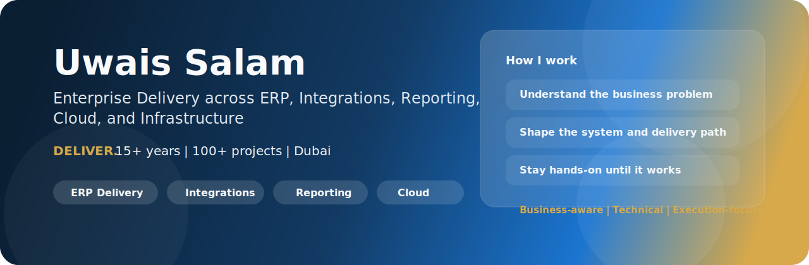
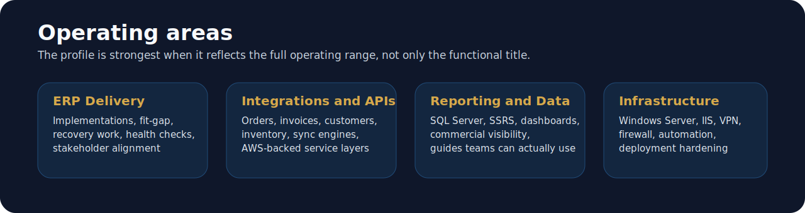

 

<strong>I turn business complexity into working systems.</strong>

  

## Profile

I lead enterprise delivery across ERP, integrations, reporting, cloud, and infrastructure.

My core strength is operating at the seam between business and technology: understanding the real-world process, shaping the solution, driving execution, and getting hands-on when the system needs it.

Across 100+ projects, I have worked on:

- ERP delivery across Sage 300, Sage X3, Dynamics, and NAV
- API and sync work for orders, invoices, customers, inventory, and master data
- SQL Server and SSRS reporting for commercial, finance, and operations teams
- AWS-backed portals, serverless APIs, and automation layers
- Windows Server, IIS, VPN, firewall, deployment, and support work
- client-facing guides, health checks, recovery plans, and adoption support

> Much of my enterprise delivery footprint lives in private repos, client servers, and protected environments, so this GitHub profile shows the builder side of my work more than the full delivery volume.

## What I Actually Do

### ERP Delivery

- lead implementations from discovery to go-live
- run fit-gap, process translation, and execution planning
- recover at-risk projects and run ERP health checks
- align client, delivery, and technical teams around outcomes

### Integrations and APIs

- design Sage-centered integration flows
- build REST APIs and sync engines
- expose ERP data to portals, dashboards, and partner systems
- work across AWS Lambda, API Gateway, DynamoDB, S3, and CloudFront

### Reporting and Data

- build SQL Server reporting layers
- design and brand SSRS portals and dashboards
- improve commercial visibility for leadership teams
- create guides and structured documentation users can follow

### Infrastructure and Automation

- work on Windows Server, IIS, VPN, firewall, and remote access setups
- build PowerShell and Python automation for delivery and operations
- harden deployment flows and reduce manual steps
- use AI-assisted workflows where they genuinely improve speed and quality

## Signature Work

- Delivered ERP programs and integration tracks around Sage 300 and Sage X3.
- Built portals, budget tools, reconciliation workflows, and reporting layers on top of enterprise data.
- Shipped branded SSRS reporting experiences and SQL-backed commercial dashboards.
- Built AWS-backed APIs and sync services that help teams work beyond the ERP interface.
- Produced operational guides, recovery material, and structured delivery documentation.
- Built public software products that reflect the same delivery mindset in product form.

## Public Builds

| Project | What It Shows |
| --- | --- |
| [Caffeinator](https://github.com/Ublaze/Caffeinator) | Windows utility design, native API thinking, product polish |
| [Windows11-Optimizer](https://github.com/Ublaze/Windows11-Optimizer) | PowerShell automation, systems thinking, safe optimization |
| [YTune](https://github.com/Ublaze/YTune) | Product building beyond ERP, mobile and Kotlin work |

## Toolbox

## Connect

