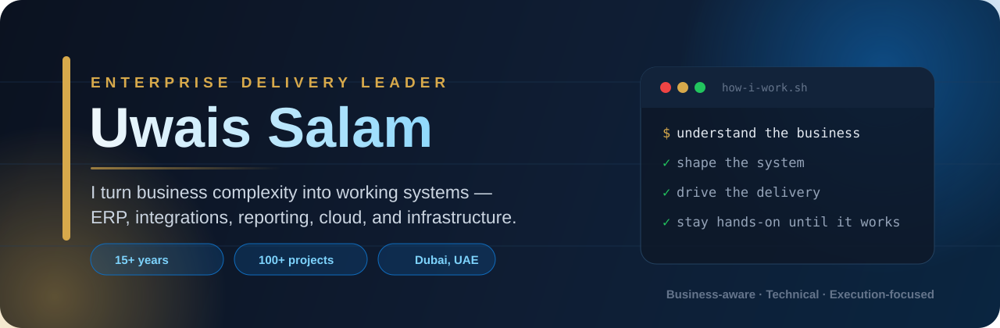
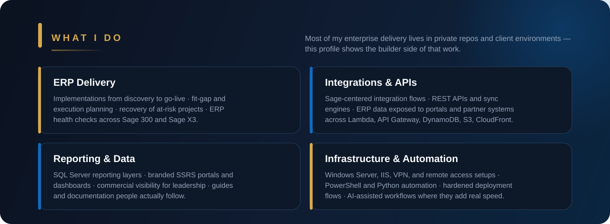
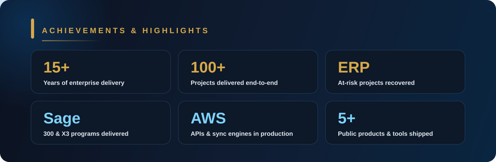

 

## Achievements

## Public Builds

| Project | What It Shows |
| --- | --- |
| [Caffeinator](https://github.com/Ublaze/Caffeinator) | Windows utility design, native API thinking, product polish |
| [Windows11-Optimizer](https://github.com/Ublaze/Windows11-Optimizer) | PowerShell automation, systems thinking, safe optimization |
| [YTune](https://github.com/Ublaze/YTune) | Product building beyond ERP, mobile and Kotlin work |
| [github-readme-generator](https://github.com/Ublaze/github-readme-generator) | Claude Code skill that generates polished READMEs with banners, badges, and diagrams |
| [github-showcase](https://github.com/Ublaze/github-showcase) | Claude Code skill that turns any GitHub project into styled social posts as Word documents |

## Private Delivery Snapshot

Client and product details stay confidential — this is the shape of the work, not the names.

| Area | What It Involved |
| --- | --- |
| Retail ERP integration | Push APIs, DynamoDB → SQL staging sync, and SSRS reporting for a retail group |
| Supplier & customer portal | TypeScript portal syncing supplier/customer data with ERP |
| Ticketing platform | Full rebuild of a commercial ticketing platform (TypeScript) |
| UAE e-invoicing compliance | Client registration and onboarding automation (Python) |
| Document workflows | Scanning, processing, and handover-analysis tooling (Python/PHP) |
| HR solutions | HR/payroll product delivery and customization |
| Internal ops tooling | Meeting, delivery-tracking, and knowledge-hub systems for a consulting group |
| Zoho integration | Portal work on top of Zoho |
| AMC tracking | Annual maintenance contract tracking system |
| AI workflow tooling | Session-persistence MCP server for AI-assisted delivery |

## Toolbox

## Connect

